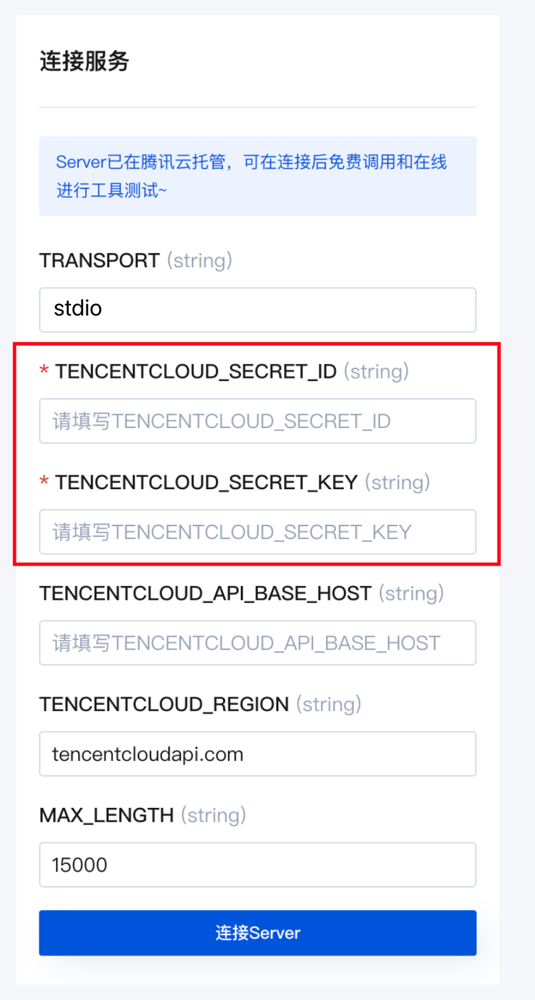

# 🤖 SuperBizAgent - 智能 OnCall Agent 系统

> 🚀 通过 AI Agent 解决团队真实痛点，整合知识库、对话、运维三大核心能力，实现问题自动应答和故障智能排查的一体化服务

[](https://go.dev/)
[](LICENSE)

## 📖 项目简介

SuperBizAgent 是一个基于 AI Agent 的智能 OnCall 系统，致力于降低团队 OnCall 的人力成本，提升团队效率。系统将运维响应时间从**小时级降低到分钟级**，知识检索准确率达到 **85%+**。

### ✨ 核心能力

- 📚 **智能知识库** - 基于 RAG 技术的文档检索增强生成
- 💬 **智能对话** - 支持多轮对话的 ReAct Agent
- 🔧 **智能运维** - 基于 Plan-Execute-Replan 的 AIOps Agent

## 🛠️ 技术栈

- **框架**: Goframe + Eino
- **AI 技术**: RAG、ReAct、Plan-Executor、Multi-Agent
- **协议**: MCP (Model Context Protocol)
- **数据库**: 向量数据库 + MySQL
- **监控**: Prometheus

## 🏗️ 系统架构

系统采用模块化的 Agent 工作流设计，包含三个核心 Agent：

### 1️⃣ Knowledge Index Agent

- 📄 文档向量化存储与检索
- 🔍 智能检索增强生成（RAG）
- 🎯 知识检索准确率 85%+

### 2️⃣ Chat ReAct Agent

- 💭 多轮对话上下文记忆
- 🔄 业务咨询、告警自救、工单预处理场景无缝切换
- ⚡ 基于 SSE 的流式对话输出

### 3️⃣ Plan-Execute-Replan Agent

- 📊 根据告警信息自动规划执行步骤
- 🔎 自动查询监控信息和日志
- 💡 结合历史工单生成运维建议

## 🎯 核心功能

### 📚 RAG 知识库系统

```
文档上传 → 向量化处理 → 存储 → 智能检索 → 增强生成
```

- ✅ 支持内部文档的智能检索
- ✅ 提供准确的业务咨询和技术支持
- ✅ 优化的文档分块和 TopK 参数配置

### 💬 智能对话系统

- 🎭 **多场景支持**: 覆盖研发、运维、业务方多角色需求
- 🧠 **上下文管理**: 保留最近 50 轮完整对话 + 历史摘要
- ⚡ **流式输出**: 基于 SSE 实现实时对话效果
- 🔒 **会话隔离**: 支持万级并发用户的独立会话管理
- 📉 **性能优化**: 上下文 Token 使用率降低 60%

### 🔧 AIOps 智能运维

完整的自动化运维流程：

```
告警触发 → 检索知识库 → 规划步骤 → 调用工具 → 分析结果 → 生成建议
```

**集成工具**（通过 MCP 协议）:

- 📝 日志查询工具
- 📊 Prometheus 告警查询
- 💾 MySQL 数据操作
- 🌐 联网查询

## 🌟 项目亮点

### 🎨 模块化 Agent 架构

- 通过图编排实现灵活的工作流
- 标准化工具封装，支持 LLM 自主选择和组合调用
- 基于 MCP 协议的工具集成方案

### 🚀 性能优化

- **响应速度**: 运维响应时间从小时级 → 分钟级
- **上下文优化**: Token 使用率降低 60%
- **检索准确率**: 知识检索准确率 85%+
- **并发能力**: 支持万级并发用户

### 🛡️ 稳定性保障

- 对话摘要机制防止上下文窗口超限
- 用户 ID 会话隔离避免上下文混淆
- 容错处理优化用户体验

## 🚀 快速开始

### 📋 环境准备

#### 1. Go 环境安装

- **Go 安装指南**: [GoFrame 官方文档](https://goframe.org/docs/install-go/index)
- **Go Module 配置**: [配置说明](https://goframe.org/docs/install-go/go-module)
- 要求版本: Go 1.21+

#### 2. Docker 安装

根据你的操作系统选择对应的安装方式：
- **安装教程**: [Docker 安装指南](https://www.runoob.com/docker/windows-docker-install.html)

安装完成后，在 Docker Desktop 的设置中配置镜像源以加速下载：


在 Docker Desktop 设置中添加以下镜像源配置：

```json
{
  "builder": {
    "gc": {
      "defaultKeepStorage": "20GB",
      "enabled": true
    }
  },
  "experimental": false,
  "registry-mirrors": [
    "https://docker.hpcloud.cloud",
    "https://docker.m.daocloud.io",
    "https://docker.unsee.tech",
    "https://docker.1panel.live",
    "http://mirrors.ustc.edu.cn",
    "https://docker.chenby.cn",
    "http://mirror.azure.cn",
    "https://dockerpull.org",
    "https://dockerhub.icu",
    "https://hub.rat.dev",
    "https://proxy.1panel.live",
    "https://docker.1panel.top",
    "https://docker.m.daocloud.io",
    "https://docker.1ms.run",
    "https://docker.ketches.cn"
  ]
}
```

#### 3. 大模型 API 配置

**使用字节跳动火山云（新用户送 50 万 Token）**

1. **注册账号**: [火山云控制台](https://console.volcengine.com/home)

2. **创建 API Key**: [API Key 管理页面](https://console.volcengine.com/ark/region:ark+cn-beijing/apiKey)
   - 创建后请妥善保存 API Key，后续需要配置到项目中


3. **开通模型**: [模型管理页面](https://console.volcengine.com/ark/region:ark+cn-beijing/openManagement)
   - 语言模型 → DeepSeek-V3.1（开通）
   - Embedding 模型 → DeepSeek-V3.1（开通）

#### 4. CLS MCP 配置（日志查询工具）

1. **登录腾讯云**: [腾讯云控制台](https://console.cloud.tencent.com/)

2. **创建密钥**: [API 密钥管理](https://console.cloud.tencent.com/cam/capi)
   - 创建并保存 Secret ID 和 Secret Key

3. **配置 MCP Server**
   - 进入腾讯云 CLS MCP 配置页面
   - 第一个选项填写 `stdio`
   - 填入刚才保存的 Secret ID 和 Secret Key
   - 点击连接 Server



4. **保存 MCP URL**
   - 连接成功后会返回一个 URL，保存下来用于后续配置

#### 5. 项目配置文件

编辑 `config.yaml` 文件，配置以下参数：

```yaml
# API Key 配置
api_key: "your_volcengine_api_key"  # 火山云 API Key（所有模型共用）

# 文档存储目录
file_dir: "/path/to/your/documents"  # 用户上传文档的存储路径

# MCP 配置
cls_mcp_url: "your_mcp_url"  # 上一步获取的 MCP URL
```

### 📋 前置要求总结

- ✅ Go 1.21+
- ✅ Docker & Docker Compose
- ✅ Node.js (用于前端)
- ✅ 火山云 API Key
- ✅ 腾讯云 CLS MCP 配置（可选）

### 🔧 安装步骤

#### 1️⃣ 克隆项目

```bash
git clone https://github.com/yourusername/SuperBizAgent.git
cd SuperBizAgent
```

#### 2️⃣ 启动向量数据库 Milvus

```bash
# 进入 docker 配置目录
cd manifest/docker

# 一键启动所有依赖
docker compose up -d

# 如果需要停止服务
# docker compose down
```

#### 3️⃣ 启动后端服务

```bash
# 返回项目根目录
cd ../..

# 安装依赖
go mod download

# 配置环境变量（如需要）
cp .env.example .env

# 启动后端
go run main.go
```

#### 4️⃣ 启动前端服务

```bash
# 进入前端目录
cd SuperBizAgentFrontend

# 赋予启动脚本执行权限
chmod +x start.sh

# 启动前端
./start.sh
```

### ✅ 验证安装

启动成功后，访问：
- 🌐 前端界面：`http://localhost:3000`（具体端口以实际配置为准）
- 🔌 后端 API：`http://localhost:8080`（具体端口以实际配置为准）

## 📊 使用场景

| 场景          | 描述                       | 效果             |
| ------------- | -------------------------- | ---------------- |
| 🔍 业务咨询   | 基于知识库的智能问答       | 快速获取准确答案 |
| 🚨 告警自救   | 自动分析告警并提供解决方案 | 减少人工介入     |
| 📋 工单预处理 | 自动分类和初步诊断         | 提升工单处理效率 |
| 🔧 故障排查   | 自动化日志分析和监控查询   | 小时级 → 分钟级  |


⭐ 如果这个项目对你有帮助，欢迎 Star！

